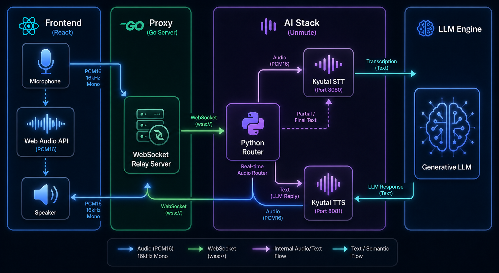

# Audio Escape Game Maker

A platform for creating and playing **voice-driven escape games** powered by AI. The entire interface is audio: the player speaks, an AI game master responds, and game logic (inventory, room state, puzzles) is managed server-side via LLM tool calls — invisible to the player. Each scenario defines its own AI persona, puzzles, rooms, and sound effects — the platform handles the rest.



---

## How It Works

```
Player (mic) ──▶ Unmute (STT+TTS) ──▶ LLM Proxy (Go) ──▶ Upstream LLM (Scaleway)
                        │                      │
                        │                      ├── Rewrites system prompt with persona + live game state
                        │                      ├── Intercepts tool calls (inspect, take, use, pin code)
                        │                      └── Feeds results back to LLM for narration
                        │
                   WebSocket ──▶ Frontend (React)
                                      ├── Audio visualizer
                                      ├── Game state panels (rooms, inventory)
                                      ├── SFX playback (per-scenario)
                                      └── Scenario selection UI
```

1. The player connects via WebSocket, which bridges audio to [Unmute](https://github.com/kyutai-labs/unmute) (STT + TTS).
2. Unmute sends chat completions to the **LLM Proxy** — a Go server that rewrites the system prompt with the scenario's AI persona and live game state, then forwards to the upstream LLM.
3. When the LLM emits a tool call (`inspect_item`, `take_item`, `use_item`, `input_pin_code`), the proxy executes it on the **Game Engine** (FSM), feeds the result back, and the LLM narrates the outcome.
4. SFX triggers and game state updates are broadcast to the frontend in real time.

---

## Project Structure

```
escape-game/
├── cmd/server/main.go          # Entry point — HTTP server, endpoints, wiring
├── internal/
│   ├── ai/
│   │   ├── gameconfig.go       # Scenario config loading + ListScenarios
│   │   ├── llmproxy.go         # OpenAI-compatible proxy, tool call dispatch
│   │   ├── llmproxy_test.go    # Unit tests
│   │   └── unmute.go           # Unmute WebSocket client (audio bridge)
│   ├── game/
│   │   ├── state.go            # Game state structs (RoomState, PlayerState, etc.)
│   │   ├── evaluator.go        # Game engine — action handlers, FSM logic
│   │   └── scenario.go         # JSON scenario loader
│   └── network/
│       └── websocket.go        # WebSocket server, scenario reload, SFX broadcast
├── config/
│   ├── fr/
│   │   └── projet_longevite/   # Default French scenario
│   │       ├── scenario.json       # Metadata (name, description, difficulty)
│   │       ├── persona.txt         # AI persona (system prompt base)
│   │       ├── intro_directive.txt # First-turn directive
│   │       ├── intro_prompt.txt    # Hidden TTS intro prompt
│   │       ├── room_state.json     # Room layout, items, puzzles
│   │       ├── player_state.json   # Initial player state
│   │       └── function_calls.json # LLM tool definitions
│   └── en/
│       └── projet_longevite/   # English version
├── frontend/
│   ├── src/
│   │   ├── App.tsx             # Main UI — scenario picker, visualizer, panels, logs
│   │   ├── hooks/
│   │   │   ├── useAudioStream.ts   # WebSocket audio streaming + SFX playback
│   │   │   └── useGameState.ts     # Game state management
│   │   └── components/
│   │       ├── AudioVisualizer.tsx
│   │       └── GamePanel.tsx
│   ├── public/sounds/
│   │   ├── ambient_drone.opus      # Shared ambient background
│   │   └── projet_longevite/       # Per-scenario SFX (.opus files)
│   ├── Dockerfile
│   └── nginx.conf.template
├── Dockerfile                  # Backend (Go) multi-stage build
├── Makefile                    # Build, deploy, scenario scaffolding
├── secrets.mk.example          # Template for gitignored secrets
└── go.mod
```

---

## Configuration

### Scenario Files

Each scenario lives in `config/<lang>/<scenario_id>/` and contains:

| File | Purpose |
|------|---------|
| `scenario.json` | Display metadata: `name`, `description`, `difficulty` (`easy`/`medium`/`hard`) |
| `persona.txt` | AI persona — the base system prompt defining the game master's character |
| `intro_directive.txt` | Appended to the system prompt on the first turn (sets the scene) |
| `intro_prompt.txt` | Hidden prompt sent to the TTS engine for the cinematic intro |
| `room_state.json` | Room layout with interactive items, puzzles, states, and SFX triggers |
| `player_state.json` | Initial player state (current room, inventory, history) |
| `function_calls.json` | LLM tool definitions (`inspect_item`, `take_item`, `use_item`, `input_pin_code`) |

### Environment Variables

| Variable | Default | Description |
|----------|---------|-------------|
| `GAME_LANGUAGE` | `fr` | Language directory under `config/` |
| `CONFIG_DIR` | `config` | Root config directory path |
| `LLM_UPSTREAM_URL` | `https://api.scaleway.ai/v1` | Upstream LLM API URL |
| `LLM_MODEL` | `gemma-3-27b-it` | LLM model name |
| `LLM_API_KEY` | — | API key for the upstream LLM |
| `UNMUTE_WS_URL` | — | Unmute WebSocket URL for STT/TTS |
| `UNMUTE_VOICE` | `cml-tts/fr/...enhanced.wav` | TTS voice path |

### Secrets

Sensitive values are stored in a gitignored `secrets.mk` file:

```bash
cp secrets.mk.example secrets.mk
# Edit secrets.mk with your actual values
```

---

## API Endpoints

| Endpoint | Method | Description |
|----------|--------|-------------|
| `/scenarios` | GET | List available scenarios for the configured language |
| `/ws` | WS | WebSocket connection (accepts `?scenario=<id>` query param) |
| `/chat/completions` | POST | OpenAI-compatible chat completions (used by Unmute) |
| `/v1/chat/completions` | POST | Alias for the above |
| `/models` | GET | List available LLM models |
| `/game-state` | GET | Current game state (rooms, inventory, oxygen) |
| `/debug` | GET | Debug info (tools loaded, config status) |

---

## Development

### Prerequisites

- **Go** 1.26+
- **Node.js** 18+ and npm
- **Docker** (for container builds)
- [Scaleway CLI](https://github.com/scaleway/scaleway-cli) (for deployment)

### Local Development

**Backend:**

```bash
# Set required env vars (or use secrets.mk)
export LLM_API_KEY="your-key"
export UNMUTE_WS_URL="ws://localhost:8000/v1/realtime"

go run ./cmd/server
```

**Frontend:**

```bash
cd frontend
npm install
npm run dev
```

The frontend dev server proxies `/ws`, `/scenarios`, and `/game-state` to the backend.

### Creating a New Scenario

```bash
make new-scenario
```

This interactively prompts for:
1. **Language** (`fr` or `en`, defaults to `fr`)
2. **Scenario ID** (e.g. `mon_nouveau_scenario`)

It then scaffolds:
- `config/<lang>/<scenario_id>/` with all 7 template files
- `frontend/public/sounds/<scenario_id>/` for SFX audio files

Edit the generated files to define your scenario's persona, rooms, puzzles, and tools.

### Running Tests

```bash
go build ./...
go test ./internal/... -count=1
```

---

## Deployment

Deployment targets **Scaleway Serverless Containers**.

### Setup

1. Authenticate with Scaleway:
   ```bash
   make scw-login
   ```

2. Create `secrets.mk` with your secret values (see `secrets.mk.example`).

### Deploy

```bash
# Deploy backend only
make deploy-backend

# Deploy frontend only (requires backend to be deployed first)
make deploy-frontend

# Deploy both
make deploy-all
```

The Makefile handles:
- Building and pushing Docker images to Scaleway Container Registry
- Creating/updating Serverless Containers
- Wiring environment variables and secrets
- Waiting for containers to be ready

### Unmute (STT/TTS)

Unmute can be self-hosted using the provided Docker Compose files:

- `docker-compose.unmute.yml` — Pre-built Kyutai images
- `docker-compose.onstart.yml` — Build from source (requires GPU)

Set `UNMUTE_WS_URL` to point to your Unmute instance.

---

## Tech Stack

| Component | Technology |
|-----------|-----------|
| Backend | Go 1.26, gorilla/websocket |
| Frontend | React 18, TypeScript, Vite, TailwindCSS |
| Audio | opus-recorder (encode), ogg-opus-decoder (decode) |
| STT/TTS | [Unmute](https://github.com/kyutai-labs/unmute) by Kyutai |
| LLM | Scaleway AI (OpenAI-compatible API) |
| Deployment | Scaleway Serverless Containers |
| Container | Docker multi-stage (Alpine) |

---

## Game Mechanics

### Tool Calls

The LLM interacts with the game engine through tool calls:

- **`inspect_item`** — Examine an object or zone; reveals hidden items
- **`take_item`** — Pick up a collectible item into inventory
- **`use_item`** — Use an inventory item on a room object (triggers state transitions)
- **`input_pin_code`** — Enter a PIN code on a waiting device

### State Management

The game engine maintains a finite state machine (FSM):
- **Room state**: items, visibility, inspection status, locks, puzzles
- **Player state**: current room, inventory, action history
- **Win condition**: triggered when a `wins_game` item is unlocked

### Narrative Control

The AI game master stays in character and redirects off-topic player input back to the scenario. The system prompt is dynamically rebuilt each turn with the live game state, preventing hallucinations and premature reveals.

### Oxygen Timer

Scenarios can define a countdown timer (e.g. 45 minutes of oxygen) to create urgency. The LLM is instructed to remind the player of remaining time with increasing urgency.

---

## License

This project is proprietary. All rights reserved.
